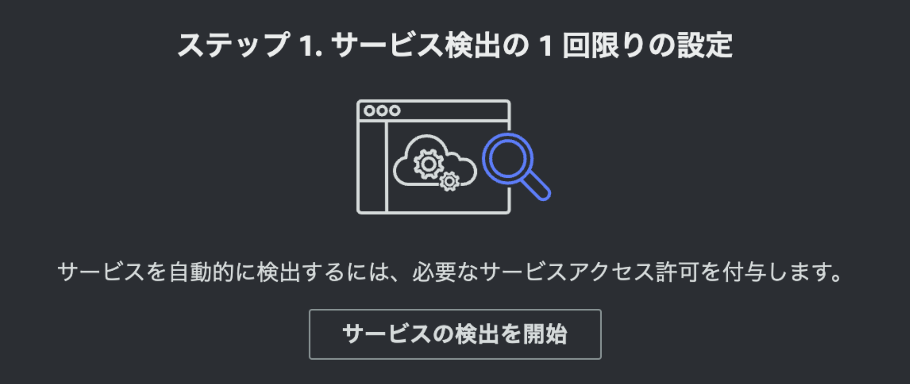
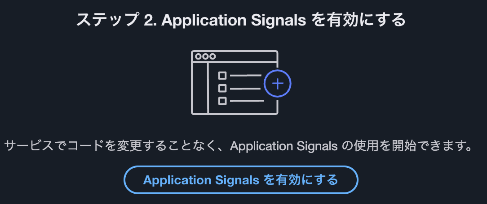
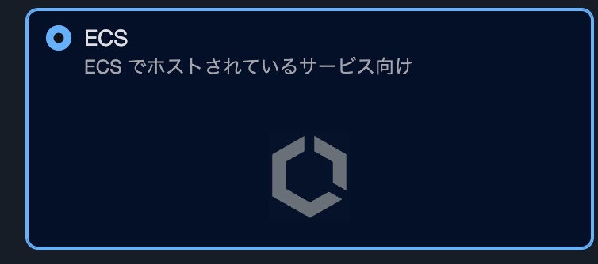

# Q Developer CLI インストール、AWS CLI インストール、uv インストール、Application Signals 有効化

ハンズオンを進めるために必要なツール類をインストールします。  

## Q Developer CLI インストール

> [!NOTE]
> Q Developer CLI インストール済の方はスキップしてください。  

Q Developer CLI をインストールします。  
[Installing Amazon Q for command line](https://docs.aws.amazon.com/amazonq/latest/qdeveloper-ug/command-line-installing.html) にアクセスし、 OS に合わせた手順でインストールしてください。  
認証は **Builders ID** を使用します。  

**Mac**

[Download Amazon Q for command line for macOS.](https://desktop-release.q.us-east-1.amazonaws.com/latest/Amazon%20Q.dmg)  
ダブルクリックしてインストーラーを起動、指示に従ってインストールしてください。  

**Linux**

```bash
ldd --version

# 2.34 以上であることを確認
ldd (GNU libc) 2.34
```

```bash
curl --proto '=https' --tlsv1.2 -sSf "https://desktop-release.q.us-east-1.amazonaws.com/latest/q-x86_64-linux.zip" -o "q.zip"

unzip q.zip

./q/install.sh
```

**Windows**

Q Developer CLI は Windows ネイティブには対応していません。  
Windows ユーザーの方はご面倒でも、EC2 Linux インスタンスを立てるか、[WSL を使って](https://dev.to/aws/the-essential-guide-to-installing-amazon-q-developer-cli-on-windows-lmh)ハンズオンをお願いします。  

## Q Developer CLI の動作確認

`q doctor` コマンドで動作確認します。`Everything looks good!` と表示されれば OK です。  

```bash
$ q doctor

✔ Everything looks good!

Amazon Q still not working? Run q issue to let us know!
```

## AWS CLI インストール

> [!NOTE]
> AWS CLI インストール済の方はスキップしてください。  

[AWS CLI のインストール](https://docs.aws.amazon.com/ja_jp/cli/latest/userguide/getting-started-install.html) に従ってインストールしてください。

## AWS CLI 設定

> [!NOTE]
> AWS CLI 設定済の方はスキップしてください。  

[AWS CLI の設定](https://docs.aws.amazon.com/ja_jp/cli/latest/userguide/getting-started-quickstart.html) に従って設定してください。  
ハンズオンでは `opsjaws-handson` というプロファイルを使用する例になっています。`opsjaws-handson` というプロファイルを作成しておくとスムーズに進められます。  

以下は設定コマンド例です。  

```bash
aws configure --profile opsjaws-handson
```

## uv インストール

MCP Server を使用するために uv をインストールします。  

> [!NOTE]
> uv インストール済の方はスキップしてください。  

[Installing uv](https://docs.astral.sh/uv/getting-started/installation/) に従ってインストールしてください。  

**Mac/Linux**

```bash
curl -LsSf https://astral.sh/uv/install.sh | sh
```

## uv 動作確認

`uv --version` コマンドで動作確認します。バージョンが表示されれば OK です。  

```bash
uv --version
```

## Application Signals 有効化

[CloudWatch](https://ap-northeast-1.console.aws.amazon.com/cloudwatch/home?region=ap-northeast-1#application-signals:services) 画面から、左ペインの **Application Signals** → **サービス** を選択します。  
初回アクセス時には以下のボタンが表示されます。**サービスの検出を開始** をクリックしてください。  



自分のアカウントでこのステップを初めて完了すると、**AWSServiceRoleForCloudWatchApplicationSignals** サービスリンクロールが作成されます。
このロールの詳細については、[CloudWatch Application Signals のサービスリンクロールのアクセス許可](https://docs.aws.amazon.com/ja_jp/AmazonCloudWatch/latest/monitoring/using-service-linked-roles.html#service-linked-role-signals) を参照してください。  


次に **Application Signals を有効にする** ボタンをクリックします。




次の画面で **ECS** にチェックを入れ、**完了** ボタンをクリックします。  



----
<nav aria-label="ページナビゲーション">  
  <ul style="display: flex; justify-content: space-between; list-style: none; padding: 0;">  
    <li style="padding: 20px; text-align: center;"><a href="README.md">目次に戻る</a></li>  
    <li style="padding: 20px; text-align: right;"><a href="chap2.md">次へ</a></li>  
  </ul>  
</nav>  
