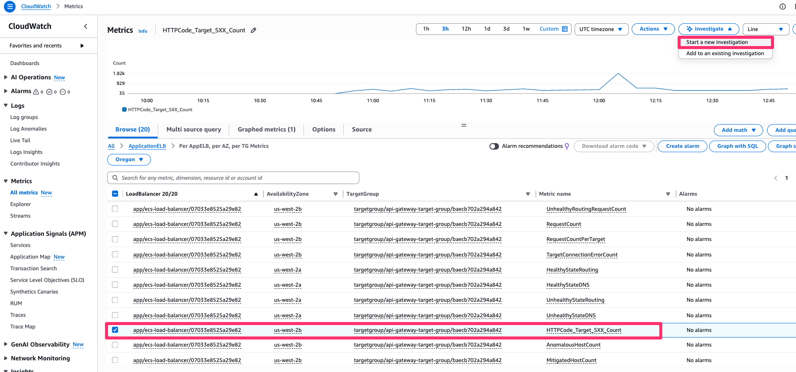
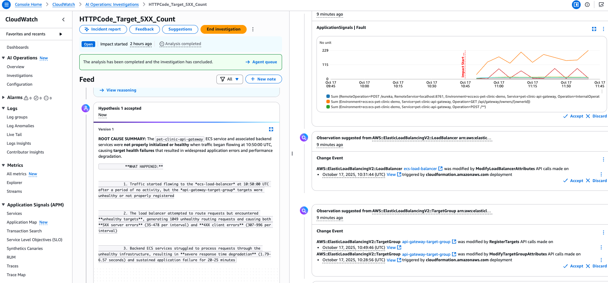

# Q Developer マネジメントコンソール（マネコン） やってみる
Q Developer はマネジメントコンソール(マネコン)からも利用でき、CloudWatch と統合して利用できる[運用調査機能](https://aws.amazon.com/jp/blogs/news/investigate-and-remediate-operational-issues-with-amazon-q-developer/)は様々なメトリクスに基づいて障害やエラーの原因分析を行うことができます。

サンプルアプリケーションで発生しているエラーに対して運用調査機能を利用してみましょう。

## Q Developer の運用調査機能の有効化

マネジメントコンソールで CloudWatch 画面を開きます。  

左メニューから **AI オペレーション** → **設定** を選択し、**このアカウント用に設定** ボタンをクリックします。  

**調査グループを作成** 画面が表示されます。今日はすべてデフォルトのまま **調査グループを作成** ボタンをクリックします。  


## Q Developer の運用調査機能やってみる
ALBで`HTTPCode_Target_5XX_Count`が多発しているため、このメトリクスを起点にどのようなエラーが発生しているか調査してみます。

まず、マネジメントコンソールの CloudWatch 画面から `All metrics` → `ApplicationELB` → `Per AppELB, per AZ, per TG Metrics` → `サンプルアプリケーション用に作成された ALB(ecs-load-balancer) の HTTPCode_Target_5XX_Count メトリクス`をチェックし `Start a new investigation`を選択します。



右側に運用調査機能用のパネルが展開されるため、調査タイトルの入力、エラーが発生しはじめた時刻を選択し `Start investigation`を選択します。

数分程待つと関連するメトリクスの一覧やエラー原因の仮説がいくつか表示されます。仮説の一例を以下に載せますが、みなさまの環境でもどんな仮説が出るのか確認してみてください。現在は英語のみに対応しているので日本語訳を載せます。



### 仮説1
仮説1つ目ではアプリケーション起動直後のリクエストが正常に処理されず、アプリケーションエラーとパフォーマンス低下が発生したことを説明しています。
```
根本原因のサマリー
pet-clinic-api-gateway ECSサービスおよび関連するバックエンドサービスが、10:50:00 UTCにトラフィックが流れ始めた時点で適切に初期化されていないか、正常な状態ではありませんでした。これによりターゲットヘルスの失敗が発生し、広範囲にわたるアプリケーションエラーとパフォーマンス低下を引き起こしました。

仮説の推論
10:50:00 UTCに、無活動の期間を経てペットクリニックアプリケーションロードバランサーへのトラフィックが流れ始めましたが、基盤となるECSサービスがリクエストを処理するために適切に初期化されていないか、正常な状態ではありませんでした。api-gateway-target-groupのターゲットが正常でないか、まだ登録されていない状態であったため、ロードバランサーが利用できないサービスにリクエストをルーティングしてしまいました。これにより、5XXサーバーエラー(インターバルあたり35〜478件)、4XXクライアントエラー(インターバルあたり307〜996件)、および1049件の異常なルーティングリクエストが連鎖的に発生し、システムが障害を起こしているバックエンドサービスを通じてリクエストを処理しようと苦闘する中で、レスポンスタイムが1.79〜6.57秒へと著しく悪化しました。
```

### 仮説2
 仮説2つ目ではマイクロサービス間の名前解決を行う discovery-server の接続障害を説明しています。この仮説では推奨する対応策も提示されています。

 ```
 根本原因のサマリー
 pet-clinic-discovery-serverサービスにおける接続障害で、localhost:8761への内部接続を確立できず、Eurekaサービスレジストリが機能しなくなったことです。これにより、すべてのマイクロサービス(pet-clinic-billing-service、pet-clinic-customers-service、pet-clinic-vets-service、pet-clinic-visits-service、pet-clinic-insurance-service)がEurekaレジストリに登録したり、相互に検出したりすることができなくなるという、カスケード的なサービスディスカバリー障害が発生しました。 サービスディスカバリーに依存してダウンストリームサービスへのリクエストをルーティングするpet-clinic-api-gatewayサービスは、バックエンドサービスを見つけられなくなったときに503 Service Unavailableエラーを返し始めました。これらの503エラーはAWSアプリケーションロードバランサーによって5XXレスポンスとして転送され、api-gateway-target-groupのHTTPCode_Target_5XX_Countメトリクス異常を直接引き起こしました。 障害パターンは、localhost:8761への117件の新規接続拒否エラー、APIゲートウェイからの477件の新規Service Unavailableエラー、およびすべてのマイクロサービス全体で15〜100%に急増した障害率を示しています。タイミングは10:31:44Z頃に発生したCloudFormationデプロイメントアクティビティと一致しており、ディスカバリーサーバーのネットワーク設定に影響を与えたインフラストラクチャの変更中に問題が発生したことを示唆しています。

 仮説の推論
 問題は、pet-clinic-discovery-server(Eureka)サービスがlocalhost:8761への接続を確立できなかったことに端を発しています。localhost:8761は、サービスレジストリ操作に必要な自身の内部エンドポイントです。この接続障害により、ディスカバリーサーバーがサービス登録やハートビート処理を含む重要な機能を実行できなくなりました。 その結果、ペットクリニックアプリケーションのすべてのマイクロサービス(billing-service、customers-service、vets-service、visits-service、insurance-service)が、Eurekaレジストリに自身を登録したり、他のサービスを検出したりすることができなくなりました。 ダウンストリームサービスへのリクエストをルーティングするためにサービスディスカバリーに依存しているapi-gatewayサービスは、必要なバックエンドサービスを見つけられなくなったときに503 Service Unavailableエラーを返し始めました。api-gatewayからのこれらの503エラーは、ロードバランサーによって5XXレスポンスとして転送され、ターゲットグループで観測されたHTTPCode_Target_5XX_Countメトリクス異常を直接引き起こしました。 タイミングは10:31:44Z頃のデプロイメントアクティビティおよび10:45:00Z〜10:50:00Z頃のサービス起動と相関しており、インフラストラクチャのデプロイメントプロセス中に問題が発生したことを示唆しています。

 対応策
 ・pet-clinic-discovery-serverサービスの設定とネットワーク設定を調査し、localhost:8761に接続できない理由を特定してください。ポートバインディング、コンテナネットワーキング、およびサービス起動シーケンスに焦点を当ててください。 

 ・pet-clinic-discovery-serverのECSタスク定義を確認し、ポートマッピング、環境変数、およびヘルスチェック設定がEurekaサーバー用に正しく設定されているかを検証してください。 
 
 ・10:31:44Zに発生したCloudFormationデプロイメントを確認し、ディスカバリーサーバーが内部接続を確立する能力に影響を与えた可能性のあるネットワークまたは設定の変更を特定してください。 
 
 ・pet-clinic-discovery-serverサービスのログとステータスを調査して現在のヘルス状態を把握し、サービス復旧のオプションを検討してください。その後、すべての依存マイクロサービスのサービス登録とヘルスを監視し、それらが適切に再接続して登録できることを確認してください。
 ```

## サービスレベル目標 (SLO) から調査を作成する

Application Signals で設定したサービスレベル目標 (SLO) からも調査を開始してみましょう。  

CloudWatch 画面の左メニューから **Application Signals (APM)** → **サービス** を選択します。

サービス一覧から `pet-clinic-api-gateway` をクリックします。

次の画面で **サービスのオペレーション** タブを選択します。

**Fault Rate** が高いサービスオペレーションをから **SLO を作成** ボタンをクリックします。

サービスレベル目標 (SLO) を作成 画面に移ります。任意のサービス目標名を入力します。ほかはデフォルト値のまま **SLO を作成** ボタンをクリックします。

作成された SLO にチェックを入れ **アクション** メニューから **調査** をクリックします。

右ペインが表示されます。**調査のタイトル** に任意のタイトル(現在のところ日本語不可)を入力し、**開始時間** をエラーが発生し始めた時刻に設定し **調査を開始** ボタンをクリックします。  

数分待つと調査が表示されます。左メニューから **AI オペレーション** → **調査** を選択し、上で作成した調査を開いてみましょう。

---

<nav aria-label="ページナビゲーション">  
  <ul style="display: flex; justify-content: space-between; list-style: none; padding: 0;">  
    <li style="padding: 20px; text-align: left;"><a href="chap4.md">前へ</a></li>  
    <li style="padding: 20px; text-align: center;"><a href="README.md">目次に戻る</a></li>  
    <li style="padding: 20px; text-align: right;"><a href="chap6.md">次へ</a></li>  
  </ul>  
</nav>  
